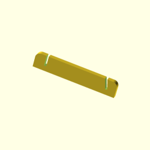

# ｽﾀｯｸﾁｬﾝ型メガネホルダー

Glasses holder shaped like Stack-chan!

 

ｽﾀｯｸﾁｬﾝ型のメガネホルダーです。  
スクリプトを実行すると3Dプリンタ用のSTLデータを作成します。

## 準備

OpenSCADのインストール  
https://openscad.org

solidpythonなど依存パッケージのインストール  

```
pip install -r requirements.txt
```

## STL作成方法

```
python make.py --stl
```

しばし待つと以下のファイルができます

| ファイル名 | せつめい | え |
| --- | --- | --- |
| _canvas.stl | パネルです |  |
| _face.stl | 表情です。多色で出力する時にお使いください |  |
| _stand_15.stl | スタンドです。2個出力しましょう |  |
| _support.stl | メガネを支えたい場合取り付けてください |  |
| *.scad | STLファイル出力用のSCADファイルです | (none) |

## オプション

* --size サイズを指定します（デフォルトは160mmです）
* --depth 厚みを指定します(デフォルトは2mmです)
* --tilt 傾きを指定します（デフォルトは15°です）
* --stl STLファイルを出力します

## About Stack-chan

ｽﾀｯｸﾁｬﾝはししかわさん が開発、公開している、
手乗りサイズのｽｰﾊﾟｰｶﾜｲｲコミュニケーションロボットです。  
作品ページ：https://github.com/stack-chan/stack-chan

## 念の為

本データを利用したことによるいかなる損害についても、作者は一切の責任を負いません。  
お使いのメガネの形状やサイズによっては、うまくはまらない場合があります。  
ご利用は自己責任でお願いいたします。
